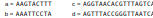
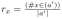
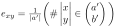
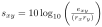
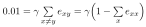
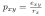
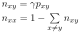

Albert-Ludwigs-Universität Freiburg

Lehrstuhl für Bioinformatik - Institut für Informatik - *http://www.bioinf.uni-freiburg.de*

---
## Bioinformatics 1
###### WS 2021/2022
##### Exercise sheet 8: Point Accepted Mutation (PAM)
---
### _Exercise 1 - PAM_
We want to calculate the PAM1 matrix based on the following two sequence alignments of the DNA sequences a, b, c and d.

  

Tip: In order to solve **a)** and **b)** create a combined alignment comprised of two combined sequences a' and b' (based on the two initial alignments and their symetric counterparts)

  
Example: (Spoiler)

  a' = a + c + b + d
  b' = b + d + a + c

  The order does not matter, as the frequency identification is position-insensitive.

Unless otherwise stated round all results to 4 decimal places.

**a)** Calculate the nucleotide frequencies rx.

  
Formula: (Spoiler)

  

    
  

**b)** Calculate the symmetric mutation probability matrix E(x,y).

  
Formula: (Spoiler)

  

    
  

**c)** Calculate the non-normalized PAM matrix S with 10*log10(odds), using the previously determined r values and E matrix. (round to integers)

  
Formula: (Spoiler)

  

    
  

**d)**

**e)** Calculate the normalization factor γ based on E.

  
Formula: (Spoiler)

  

    
  

**f)** Calculate the mutation rate matrix P.

  
Formula: (Spoiler)

  

    
  

**g)** Calculate the normalized mutation rate matrix N using P and factor γ.

  
Formula: (Spoiler)

  

    
  

