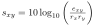
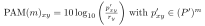

Albert-Ludwigs-Universität Freiburg

Lehrstuhl für Bioinformatik - Institut für Informatik - *http://www.bioinf.uni-freiburg.de*

---
## Bioinformatics 1
###### WS 2021/2022
##### Exercise sheet 8: Substitution Scoring
---
### _Exercise 1 - Point Accepted Mutation (PAM)_
We want to calculate the PAM1 matrix based on the following two sequence alignments of the DNA sequences a, b, c and d.

  

Tip: In order to solve **a)** and **b)** create a combined alignment comprised of two combined sequences a' and b' (based on the two initial alignments and their symetric counterparts)

  
Hint: (Click to open)

  a' = a + c + b + d

  b' = b + d + a + c

  The order does not matter, as the frequency identification is position-insensitive.

Unless otherwise stated round all results to 4 decimal places.

**a)** Calculate the nucleotide frequencies rx.

  
Formula: (Click to open)

  

    
  

**b)** Calculate the symmetric mutation probability matrix E(x,y).

  
Formula: (Click to open)

  

    
  

**c)** Calculate the non-normalized PAM matrix S with 10*log10(odds), using the previously determined r values and E matrix. (round to integers)

  
Formula: (Click to open)

  

    
  

**d)** Given the sequences _a_ = ACC and _b_ = ATT, compute the optimal Needleman-Wunsch alignments using:

1. The general similarity scoring function.

    
  

    
2. The PAM1-based similarity scoring function.

    

where _s_x,y are entries from the non-normalized PAM matrix S from above.

Select the correct answer based on the obtained results.

    

    
**e)** Calculate the normalization factor γ based on E.

  
Formula: (Click to open)

  

    
  

**f)** Calculate the mutation rate matrix P.

  
Formula: (Click to open)

  

    
  

**g)** Calculate the normalized mutation rate matrix P' using P and the normalization factor γ.

  
Formula: (Click to open)

  

    
  

**h)** Determine PAM1 based on the normalized mutation rate matrix P' with 10*log10(odds) (round to integer)

  
Formula: (Click to open)

  

    
  

**i)** Determine PAM2. (round to integer)

  
Formula: (Click to open)

  

    
  

